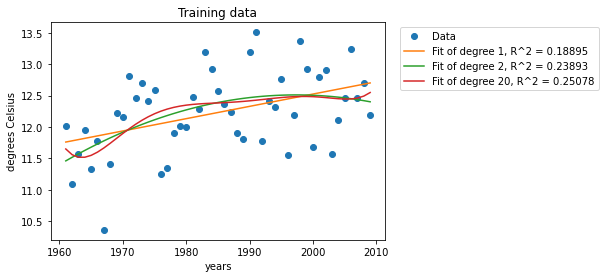
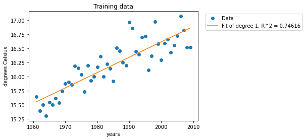

# Modeling-global-warming-

## Details
This repository introduces the fundamental model using regression analysis of climate of different areas in the United States in order to find evidence of global warming. 


## Table of Contents
- <a href='#Creating-models'>Creating Models</a>
- <a href='#Predicting-the-future'>Predicting the Future</a>
- <a href='#Modeling-extreme-temperatures'>Modeling Extreme Temperatures</a>

## Creating Models
### Curve Fitting
This function fits polynomials of the specified degrees 
to the data points. It returns the coefficients for each of the best-fit polynomials. 
```python
# Code in file global-warming-model.ipynb
def generate_models(x, y, degs):
    models = []
    for degree in degs:
        model = np.polyfit(x, y, degree)
        models.append(model)
    return models
```
### Graph of the trend toward annual temperature of random city

### Graph of the trend toward national annual temperature

### Graph of the trend toward moving average over 5 years of national annual temperature 

## Predicting the Future
## Modeling Extreme Temperatures


