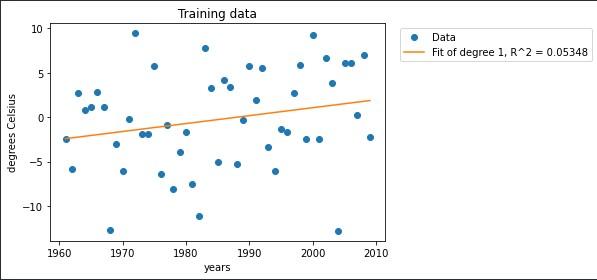
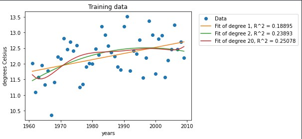
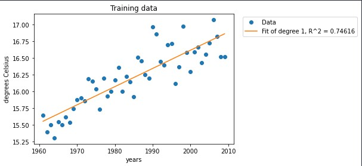
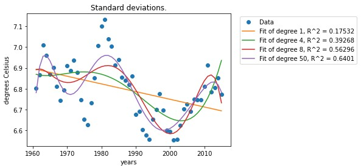

# Modeling-global-warming-

## Details
This repository introduces the fundamental model using regression analysis of climate of different areas in the United States in order to find evidence of global warming. 


## Table of Contents
- <a href='#Creating-models'>Creating Models</a>
- <a href='#Predicting-the-future'>Predicting the Future</a>
- <a href='#Modeling-extreme-temperatures'>Modeling Extreme Temperatures</a>

## Creating Models
### Curve Fitting
This function fits polynomials of the specified degrees 
to the data points of training data set. It returns the coefficients for each of the best-fit polynomials. 
```python
# Code in file global-warming-model.ipynb
def generate_models(x, y, degs):
    models = []
    for degree in degs:
        model = numpy.polyfit(x, y, degree)
        models.append(model)
    return models
```
### Graph of the trend toward annual temperature of random city
<div align="center">

</div>

### Graph of the trend toward annual temperature of random city
<div align="center">

</div>

### Graph of the trend toward national annual temperature
<div align="center">

</div>

### Graph of the trend toward moving average over 5 years of national annual temperature
<div align="center">

</div>

Therefore, we obtain the model which the data are less noisy and have clearer temperature change trends. 
## Predicting the Future
Use data from 2010-2015 to simulate the future. The data from 1961-2009 is the training data set that model is created on, and data from 2010-2015 is the test data set which I 
predict the values for. Model performance on test data is evaluated by [Root Mean Square Error (RMSE)](https://en.wikipedia.org/wiki/Root-mean-square_deviation)
### Graph of the trend toward moving average over 5 years of national annual temperature (test data set)
<div align="center">

</div>

This represents that degree = 1 model predict the best as RMSE closest to 0

## Modeling Extreme Temperatures
In addition to raising temperature, global warming also makes temperatures more extreme (e.g., very hot or very cold). This model analyze this effect by measuring the standard deviation in training data set.
### Graph of the trend toward moving average over 5 years on the annual standard deviations
<div align="center">

</div>

A standard deviation graph over these years might suggest that temperature variation is fluctuate in a downward trend.

